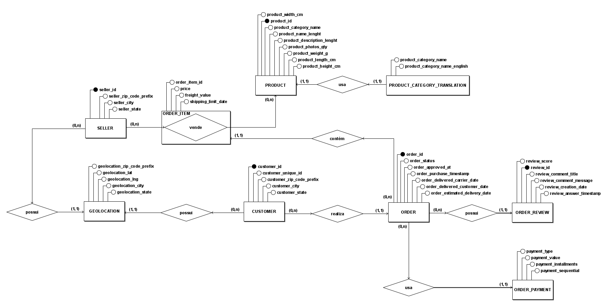

# Modelo Entidade-Relacionamento (MER) - Camada Bronze

Este documento apresenta o Modelo Entidade-Relacionamento (MER) que descreve a visão conceitual e as regras de negócio do dataset Olist. O MER foca nas entidades principais e em como elas se inter-relacionam, servindo como a base para a criação do modelo lógico (DER).

## Diagrama Conceitual

O diagrama abaixo ilustra as entidades, seus principais atributos e os relacionamentos com suas respectivas cardinalidades.

## Entidades Principais

* **CUSTOMER:** Representa o consumidor final que realiza uma compra.
* **ORDER:** Representa a transação de compra, o evento central do negócio.
* **PRODUCT:** Representa um item disponível para venda no catálogo.
* **ORDER_ITEM:** Entidade associativa que resolve a relação N:M entre `ORDER` e `PRODUCT`, detalhando qual produto, em qual quantidade e a que preço foi vendido em um pedido específico.
* **SELLER:** Representa o lojista que fornece o produto.
* **ORDER_PAYMENT:** Representa os detalhes da transação financeira do pedido.
* **ORDER_REVIEW:** Representa o feedback do cliente sobre o pedido.
* **GEOLOCATION:** Armazena as coordenadas geográficas associadas a um CEP.
* **PRODUCT_CATEGORY_TRANSLATION:** Tabela de consulta (lookup) para traduzir os nomes das categorias de produtos.

## Descrição dos Relacionamentos e Cardinalidades

A seguir, a descrição textual de cada relacionamento e sua cardinalidade, conforme o diagrama:

* **`CUSTOMER` realiza `ORDER` (Um-para-Muitos - 1:N)**
    * **Regra:** Um `CUSTOMER` pode realizar múltiplos `ORDERS`, mas um `ORDER` pertence a exatamente um `CUSTOMER`.

* **`ORDER` contém `ORDER_ITEM` (Um-para-Muitos - 1:N)**
    * **Regra:** Um `ORDER` pode ser composto por um ou mais `ORDER_ITEMS`. Cada `ORDER_ITEM` está associado a um único `ORDER`.

* **`PRODUCT` está em `ORDER_ITEM` (Um-para-Muitos - 1:N)**
    * **Regra:** Um `PRODUCT` pode ser vendido várias vezes, aparecendo em múltiplos `ORDER_ITEMS`. Cada `ORDER_ITEM` refere-se a um único `PRODUCT`.

* **`SELLER` vende `ORDER_ITEM` (Um-para-Muitos - 1:N)**
    * **Regra:** Um `SELLER` pode vender múltiplos `ORDER_ITEMS`. Cada `ORDER_ITEM` é fornecido por um único `SELLER`.

* **`ORDER` usa `ORDER_PAYMENT` (Um-para-Muitos - 1:N)**
    * **Regra:** Um `ORDER` pode ser pago através de múltiplos `ORDER_PAYMENTS` (ex: parte no cartão, parte no voucher). Cada transação de `ORDER_PAYMENT` refere-se a um único `ORDER`.

* **`ORDER` possui `ORDER_REVIEW` (Um-para-Muitos - 1:N)**
    * **Regra:** Um `ORDER` pode ter uma ou mais `ORDER_REVIEWS` (geralmente uma), e a participação é opcional (nem todo pedido é avaliado). Cada `ORDER_REVIEW` está ligada a um único `ORDER`.

* **`GEOLOCATION` possui `CUSTOMER` / `SELLER` (Um-para-Muitos - 1:N)**
    * **Regra:** Uma `GEOLOCATION` (CEP) pode estar associada a múltiplos `CUSTOMERS` ou `SELLERS`. Cada `CUSTOMER` ou `SELLER` está associado a uma única `GEOLOCATION`.

* **`PRODUCT` usa `PRODUCT_CATEGORY_TRANSLATION` (Um-para-Muitos - 1:N)**
    * **Regra:** Uma `PRODUCT_CATEGORY_TRANSLATION` pode ser aplicada a múltiplos `PRODUCTS`. Cada `PRODUCT` pertence a uma única categoria. *(Observação: A cardinalidade no diagrama para este relacionamento está imprecisa, mas a regra de negócio real é 1:N)*.